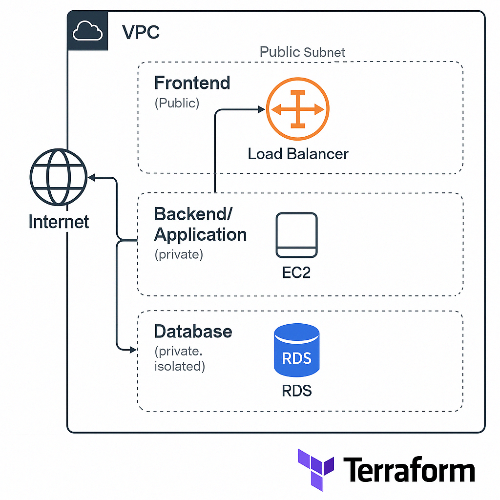

# 🚀 Multi-Tier Architecture on AWS using Terraform



---

## 🎯 Project Overview

This project demonstrates how to deploy a **Multi-Tier Web Application** on AWS using **Terraform**. It is based on a typical 3-tier architecture:

- **Frontend Layer (Public EC2 Instance)**
- **Application Layer (Private EC2 Instance)**
- **Database Layer (Private RDS Instance)**

Everything is deployed using Infrastructure as Code (IaC) principles via Terraform.

---

## 🧰 Tools Used

| Tool       | Purpose                                      |
|------------|----------------------------------------------|
| AWS        | Cloud infrastructure                         |
| Terraform  | Infrastructure as Code                       |
| VS Code    | Code editor                                  |
| MobaXterm / Terminal | SSH and CLI access to servers    |
| GitHub     | Code hosting and portfolio showcase          |

---

## 🧱 Architecture Components

- **VPC** with 3 Subnets: Public, Private-App, Private-DB
- **Security Groups** for frontend, app, and database layers
- **EC2 Instances**: 
  - Frontend in public subnet
  - App in private subnet
- **RDS MySQL Instance** in private DB subnet

---

## 📦 Files Included

- `main.tf` - AWS Provider setup
- `vpc.tf` - VPC and Subnets
- `security.tf` - Security Groups
- `ec2.tf` - EC2 Instances for Frontend and App
- `rds.tf` - RDS MySQL Database setup
- `variables.tf` - Terraform input variables
- `outputs.tf` - Terraform output variables
- `multi-tier-architecture.png` - Architecture Diagram

---

## 🚀 How to Run the Project

### Prerequisites
- AWS CLI configured (`aws configure`)
- Terraform installed
- Your key pair `.pem` file for SSH access to EC2

### Steps

```bash
terraform init
terraform plan
terraform apply
```

👉 Confirm with `yes` when prompted.

---

## 🔍 Testing Your Deployment

1. **Access the Frontend EC2** using its public IP:
   ```bash
   ssh -i yourkey.pem ec2-user@<frontend_public_ip>
   ```

2. **Ping the App EC2** (private IP) from Frontend EC2:
   ```bash
   curl <app_private_ip>
   ```

3. **Connect to RDS** using MySQL CLI (from App EC2):
   ```bash
   mysql -u admin -p -h <rds_endpoint>
   ```

---

## 🌐 Cleanup

To remove all infrastructure and avoid charges:

```bash
terraform destroy
```

---

## 📁 Showcase this on GitHub

Don’t forget to commit your project and push it to GitHub!

```bash
git init
git add .
git commit -m "Initial multi-tier architecture project"
git remote add origin https://github.com/YOUR_USERNAME/YOUR_REPO.git
git push -u origin main
```

---

### 🙌 Happy Cloud Building!
